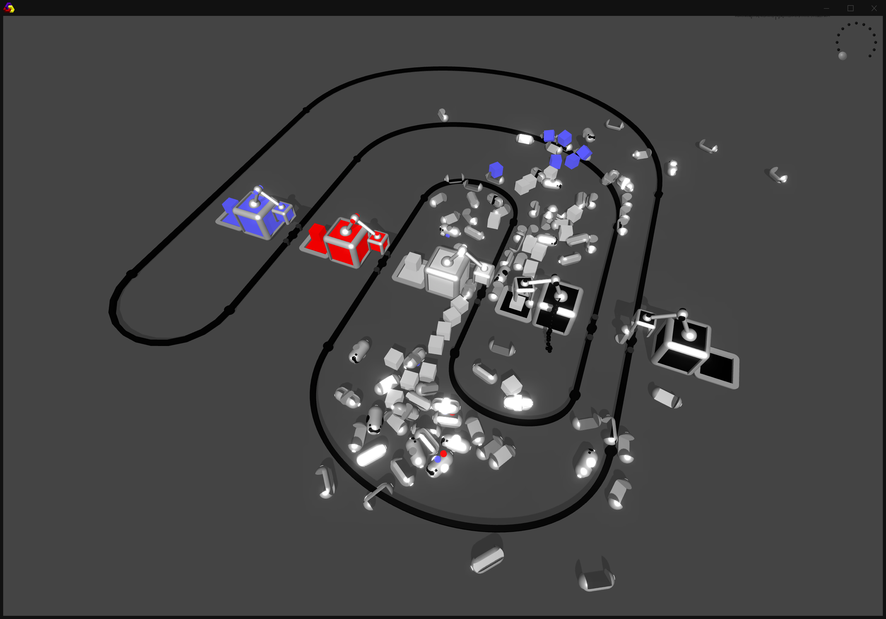
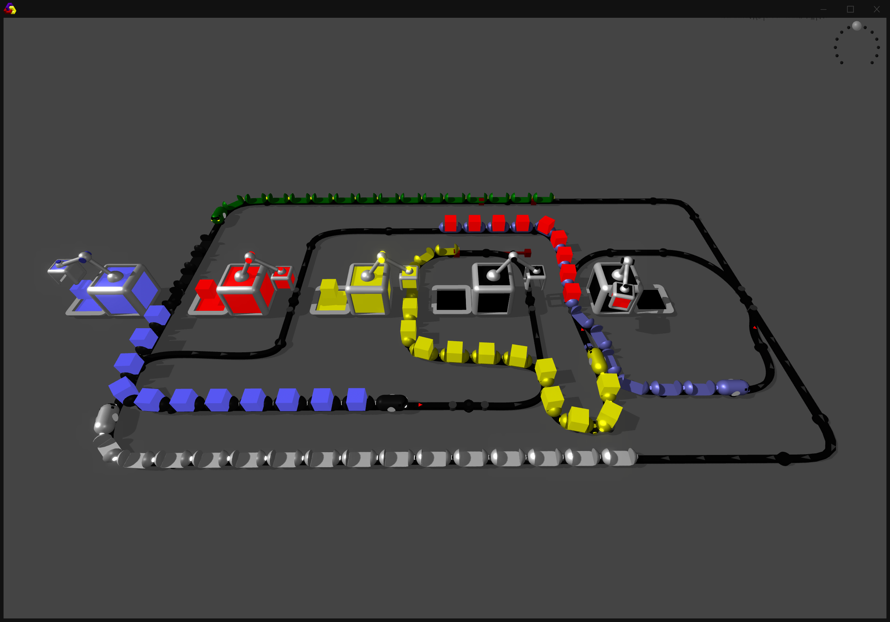
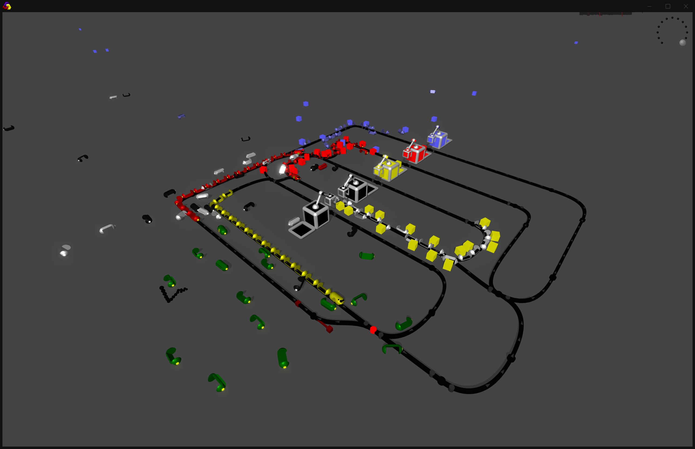

- dead eye physic trains
- use same blinking piston material for all trains
- grid lines on hovered node/ctrl centers
- tangent rods on nodes
- top view
    - orthographic camera
    - blue construction sheet grid?
- vanish ctrls by timer
- track creation
    - convert middle nodes to ctrls
    - in-between drag sets dir of node
    - split track
    - convertCtrlToNode
    - make oneWay the default
    
- train creator station
- cleaning station
    - cleaning bot
    
- multiple pins?
- attach pin to mesh?
   
- keyboard shortcut for top view, reset camera 
    
- adaptive grid size (tracks bounding box + margin)
