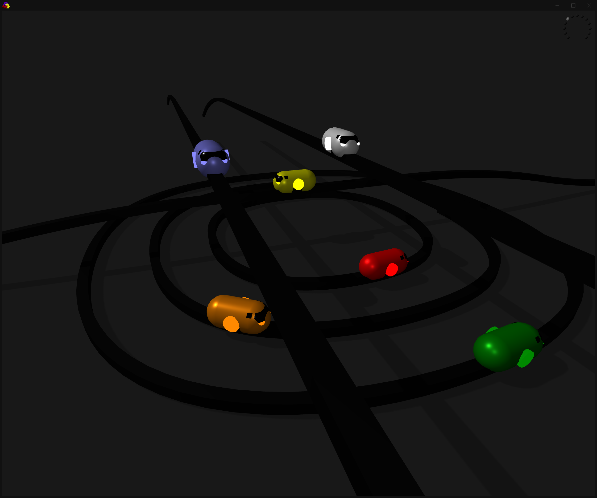
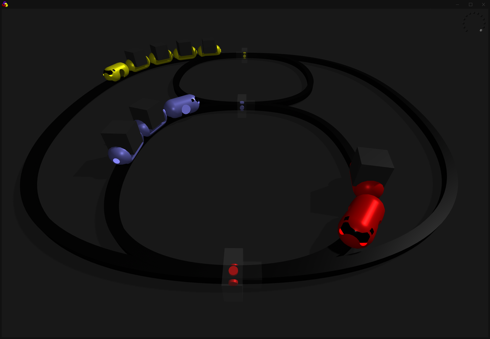
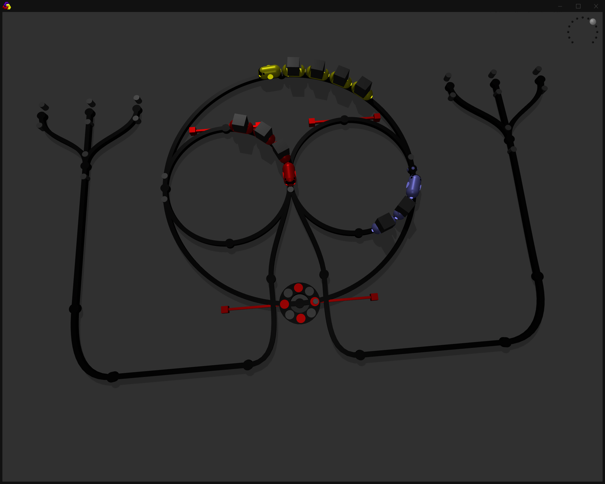
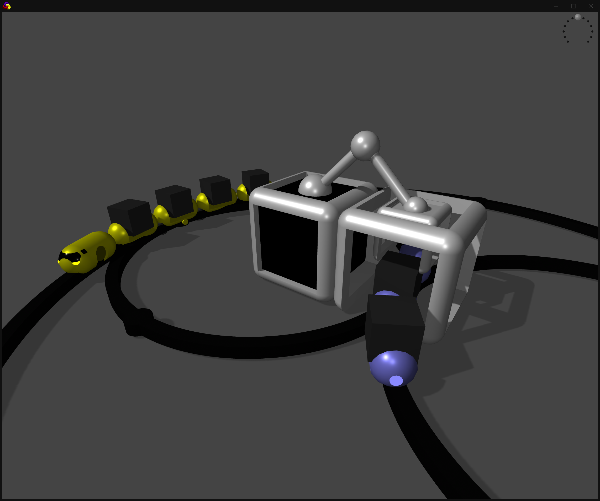
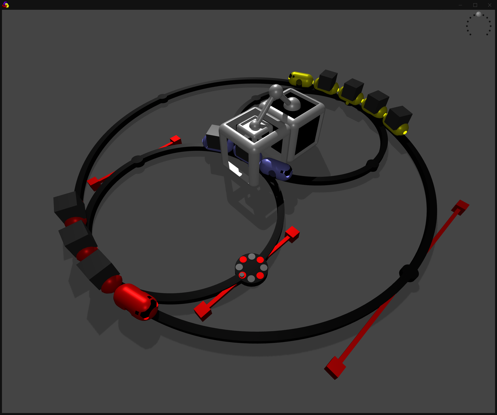

- track creation
    - covert middle nodes to ctrls
    - in-between drag sets dir of node
   
- station

- load & save
- auto path
- convertCtrlToNode
- tangent rods on nodes

- keyboard shortcut for top view, reset camera
- grid with subdivisions (10, 5)
- adaptive grid size (tracks bounding box + margin)
