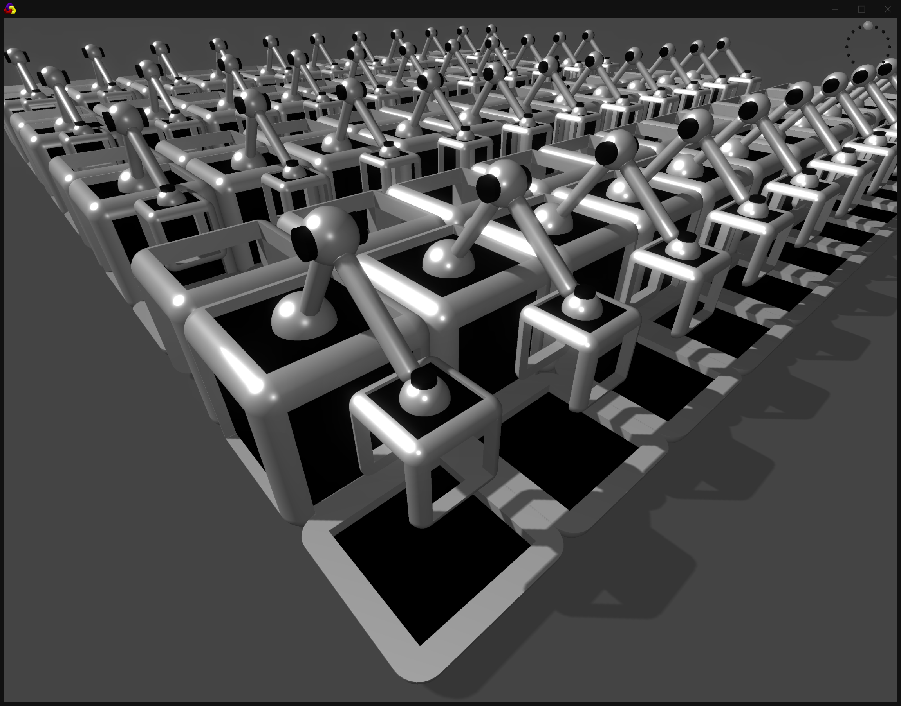

- traffic
    - check track mode
- vanish ctrls by timer
- track creation
    - convert middle nodes to ctrls
    - in-between drag sets dir of node
    - split track
    
- train creator station
- cleaning station
    - cleaning bot
- dead eye physic trains
   
- convertCtrlToNode
- tangent rods on nodes
- grid lines on hovered node/ctrl centers

- keyboard shortcut for top view, reset camera
- adaptive grid size (tracks bounding box + margin)
