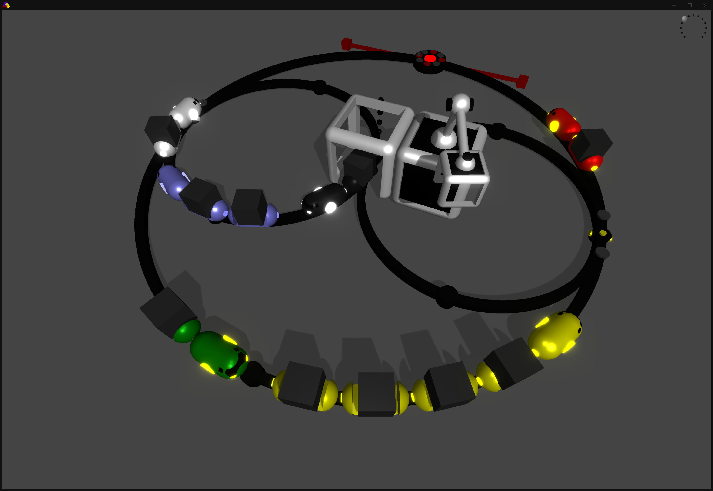

- track creation
    - covert middle nodes to ctrls
    - in-between drag sets dir of node
   
- station

- load & save
- convertCtrlToNode
- tangent rods on nodes
- grid lines on hovered node/ctrl centers

- keyboard shortcut for top view, reset camera
- adaptive grid size (tracks bounding box + margin)
